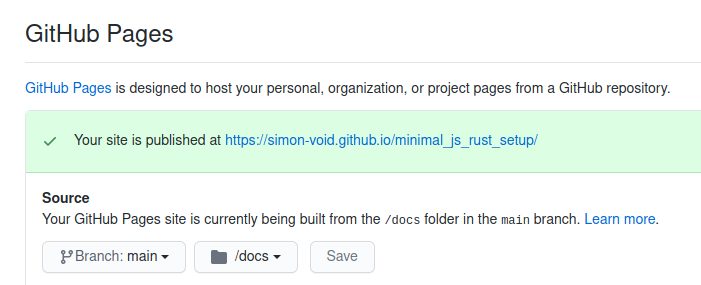

## Minimal setup of JS-Rust/WASM interop (no bundler)

You can see the resulting website [here](https://simon-void.github.io/minimal_js_rust_setup/).

#### Compiling the code

Since we want to compile the Rust code to wasm to be used without a bundler, we
have to invoke [wasm-pack](https://rustwasm.github.io/wasm-pack/installer/) for the web-target:
```
wasm-pack build --release --target web
```
This will create a pkg-folder which contains the wasm-source/module files.

#### Deploying the website on GitHub Pages

The easiest way to deploy your code (assuming it's stored on GitHub) is via GitHub Pages.
The normal way to do so is to create your project's website in the docs-folder.
(It's also possible to have your website files right in the root folder, but that seems messy.)
So that's where the html and js -files live.

Since the pgk-folder is git-ignored, but the website needs a version to function, copy the pkg-folder
into the docs-folder. Delete the copied version's `.gitignore` and `README.md` file. The second isn't needed
while the first would prevent the pkg-folders files to be commited to Git. Done. 

Well, do this step after each recompiliation of your Rust code.
Initially you also have to tell GitHub to create a GitHub Page for your project by
activating the opting under `Settings > Options > GitHub Pages`.
There are several ways to do it (more on GitHub Pages [here](https://pages.github.com/)).
This project simply uses the docs-folder in the main-branch.



#### Links

- [Rust homepage](https://www.rust-lang.org/)
- [The Rust book](https://doc.rust-lang.org/stable/book/)
- [wasm-pack](https://rustwasm.github.io/docs/wasm-pack/) documentation: the "one-stop shop for building and working with rust- generated WebAssembly "
- [wasm-bindgen](https://rustwasm.github.io/docs/wasm-bindgen/) documentation: the "Rust library and CLI tool that facilitates high-level interactions between wasm modules and JavaScript"
- [Implementing the Game of Life in Rust/wasm](https://rustwasm.github.io/docs/book/): the official "how to use Rust and WebAssembly together", uses Webpack
- [YouTube: Getting Started with WebAssembly and Rust: A First Look](https://www.youtube.com/watch?v=YHJjmsw_Sx0):  quick project setup using Webpack
